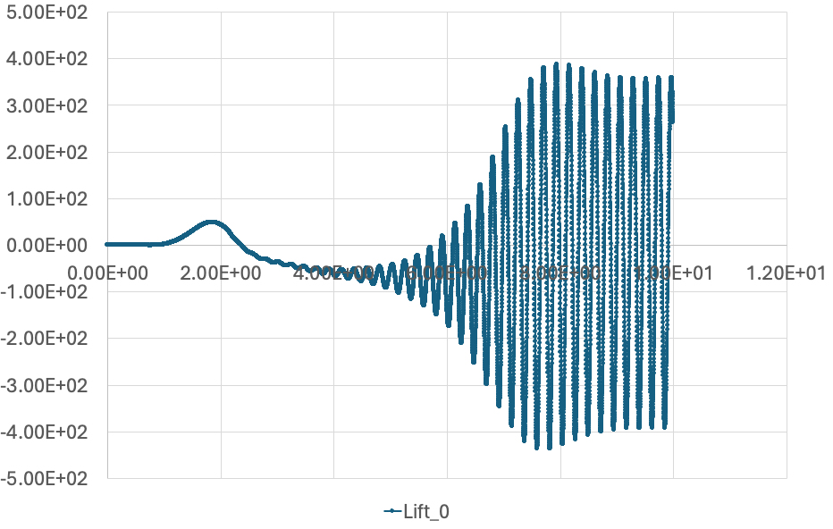
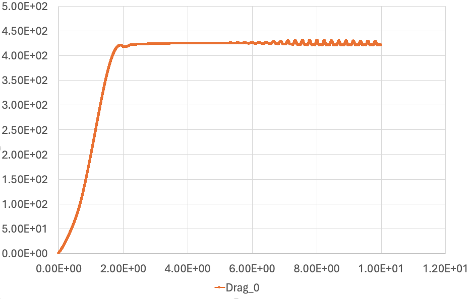
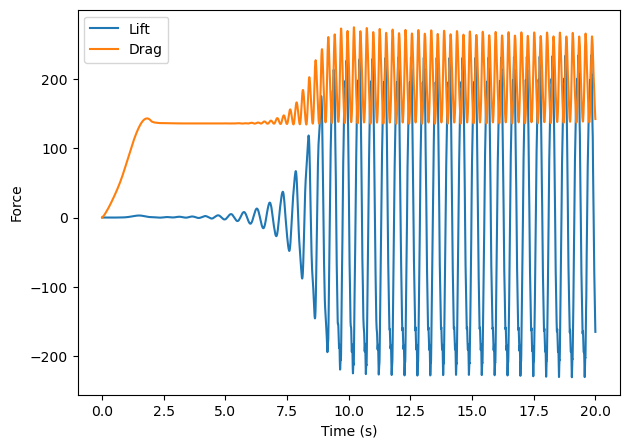
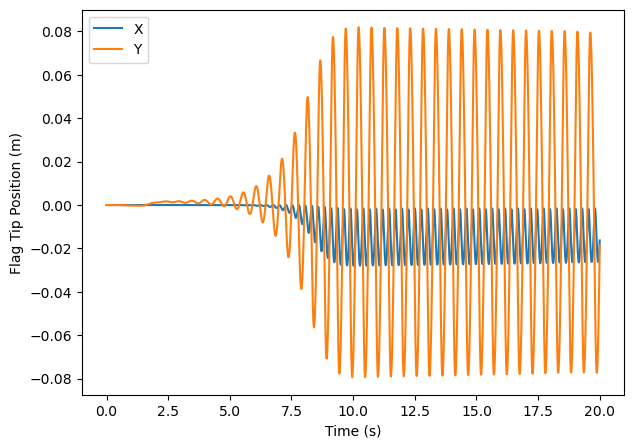

Benchmark
=========

The Flag 2D example is used to benchmark PVade. 
For more detail on the Flag 2D example, you can refer to :ref:`Flag 2D`. 

Benchmarking of PVade was done through validation of lift, drag and position of point A as described in [E.Y.]

CSD benchmark 
-------------

For benchmarking of the structural dynamics, we used CSD3 in "insert paper here" and compared the x and y position of point A (see :ref:`Flag 2D`)
The table shows the results obtained for CSD3. 
.. container::
   :name: tab:my_label

   .. table:: Results for CSM3 with timesteps :math:`\Delta T = 0.005`

      ===== ===== ======================== ========================
      \     ndof  ux of A [×10−3]          uy of A [×10−3]
      ===== ===== ======================== ========================
      CSM3  6468  −14.279 ± 14.280[1.0995] −63.541 ± 65.094[1.0995]
      PVADE 14118                             
      ===== ===== ======================== ========================

A plot for x and y position of point A is shown below 

.. image:: benchmark_png/csm3_comparison.png
  :alt: Alternative text

CFD benchmark 
-------------

For benchmarking of the fluid analysis, we used FSI3 in "insert paper here" and compared the Lift and Drag over the time of the simulation.

   .. container::
   :name: tab:my_label

   .. table:: Results for CFD3 with timesteps :math:`\Delta T = 0.001`

      ===== ======================== ========================
      \     Lift                     Drag
      ===== ======================== ========================
      CFD3  −11.893 ± 437.81[4.3956] 439.45 ± 5.6183[4.3956]
      PVADE                             
      ===== ======================== ========================

The lift and Drag versus time are shown below 

   
FSI benchmark 
-------------

    For the coupled FSI, we used FSI2 from and compared the posiion of point A as well as Lift and Drag over the duration of the simulation.
.. container::
   :name: tab:my_label

   .. table:: Results for CSM3 with timesteps :math:`\Delta T = 0.005`

      =====  ========================== ======================== ========================== =========================
      \      ux of A [×10−3]            uy of A [×10−3]          Drag                       Lift
      =====  ========================== ======================== ========================== =========================
      FSI2   −14.58 ± 12.44[3.8]        1.23 ± 80.6[2.0]         208.83 ± 73.75[3.8]        0.88 ± 234.2[2.0]
      PVADE  -14.7759 +/- 13.2306 [3.8] 1.2847 +/- 80.6161 [1.9] 204.8097 +/- 69.6025 [3.8] 1.7725 +/- 232.0870 [1.9]                         
      =====  ========================== ======================== ========================== =========================

The Lift, Drag and point A position versus time are shown below:

The simulation of FSI2 can be visualized below 

.. image:: benchmark_png/fsi2.gif
   :alt: StreamPlayer
   :align: center
