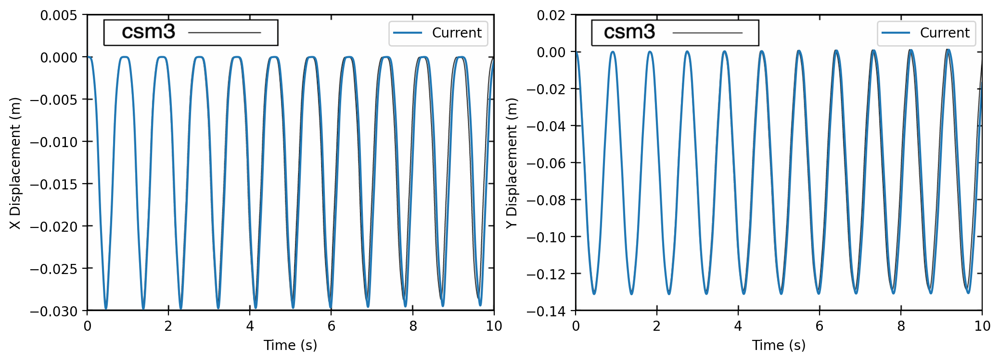
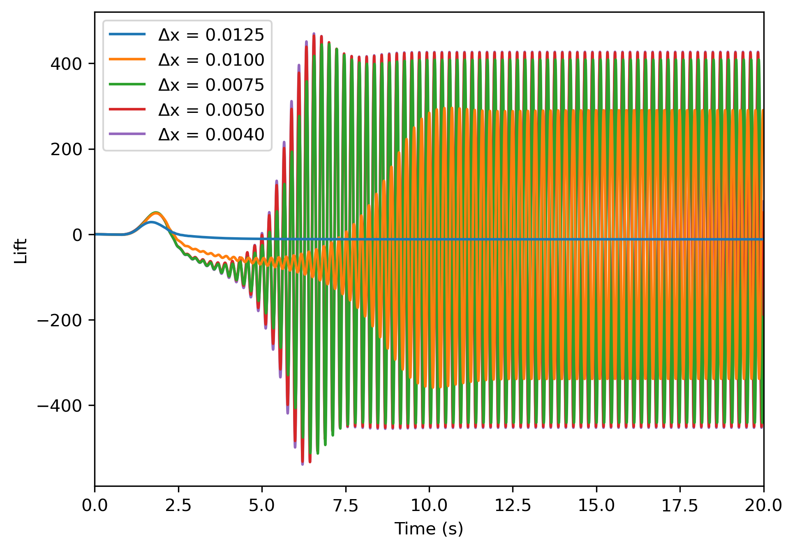
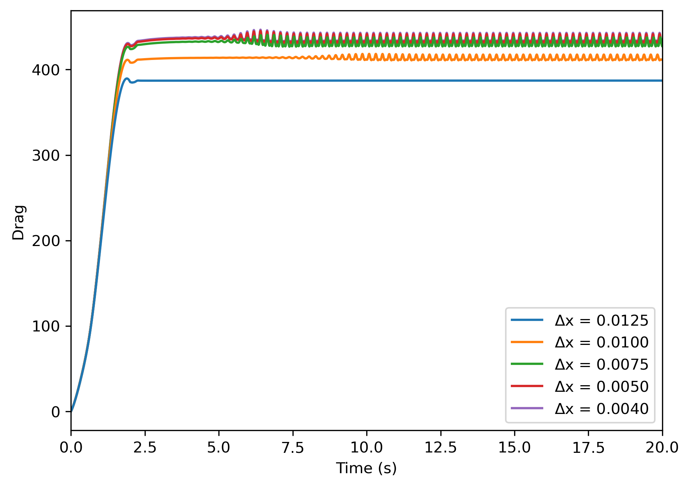
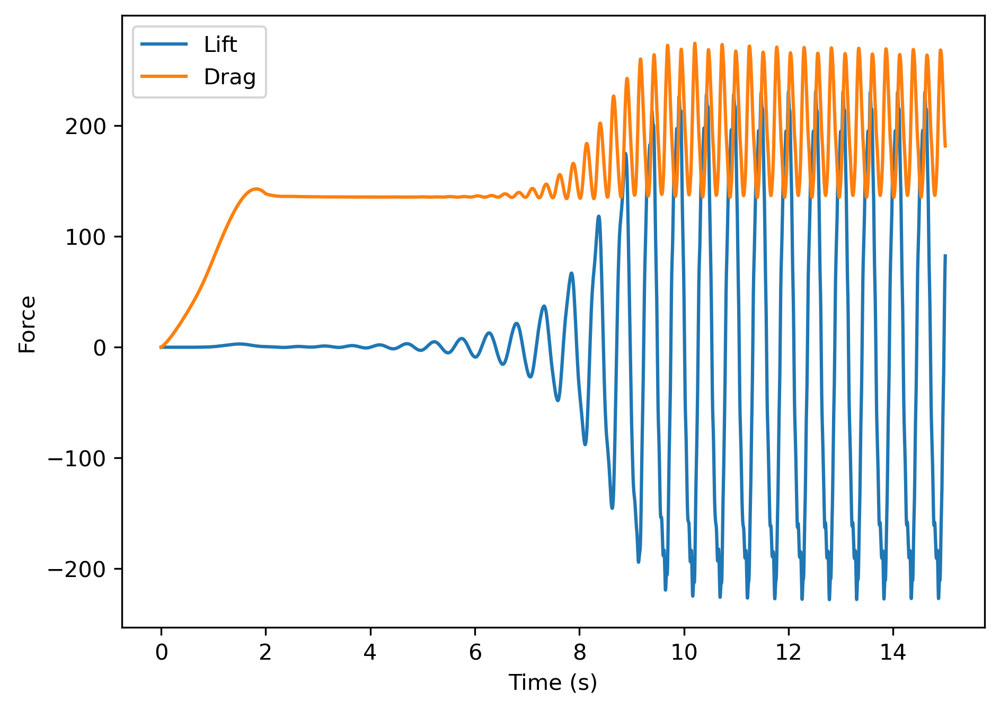
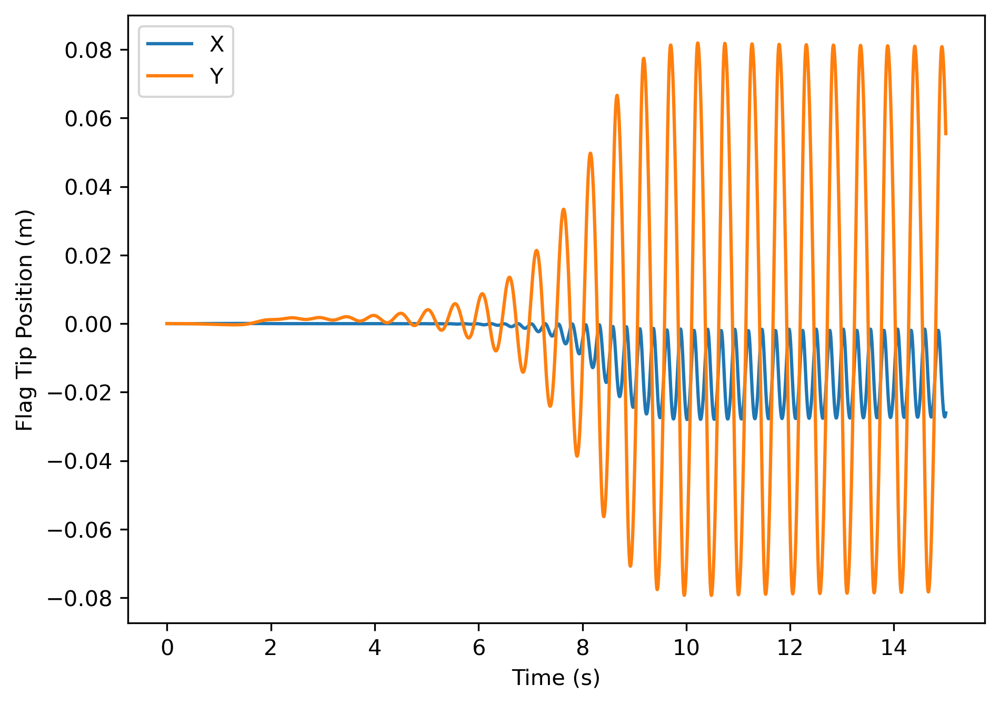

Benchmark
=========

The Flag 2D example is used to benchmark PVade. 
For more detail on the Flag 2D example, you can refer to :ref:`Flag 2D`. 
Benchmarking of PVade was done through validation of lift, drag and position of point A as described in Turek and Hron [1]_, and proceeds through three steps: (1) validation of the structure solve only (CSM3), validation of the fluid solve only (CFD3), and validation of the coupled fluid-structure interaction (FSI2).

CSM3 benchmark 
--------------

For benchmarking of the structural dynamics, we used CSM3 in Turek and Hron [1]_ and compared the x- and y-position of point A (see :ref:`Flag 2D`)
The table shows the results obtained for CSM3.

.. container::
   :name: tab:csm3

   .. table:: Results for CSM3 with timesteps :math:`\Delta T = 0.005`

      ===== ===== ======================== ========================
      \     ndof  ux of A [×10−3]          uy of A [×10−3]
      ===== ===== ======================== ========================
      PVADE 6522  -15.368 ± 15.369[1.0956] -65.624 ± 67.515[1.0956]                         
      CSM3  6468  −14.279 ± 14.280[1.0995] −63.541 ± 65.094[1.0995]
      ===== ===== ======================== ========================

A plot for x- and y-position of point A is shown below, the blue line represents the time series tip displacement obtained from PVade and the black line from the reference paper.

CFD3 benchmark 
--------------

For benchmarking of the fluid analysis, we used FSI3 in Turek and Hron [1]_ and compared the Lift and Drag over the time of the simulation.

.. container::
   :name: tab:cfd3

   .. table:: Results for CFD3 with timesteps :math:`\Delta T = 0.001`

      =============================== ========================= ===========================
      \                               Lift                      Drag
      =============================== ========================= ===========================
      PVade :math:`\Delta x = 0.0125` -11.713 ± 0.000 [0.100]   387.109 ± 0.000 [0.100]
      PVade :math:`\Delta x = 0.0100` -23.958 ± 314.375 [4.400] 414.202 ± 3.364 [4.400]
      PVade :math:`\Delta x = 0.0075` -16.137 ± 424.951 [4.400] 432.383 ± 5.289 [4.400]
      PVade :math:`\Delta x = 0.0050` -12.505 ± 437.862 [4.400] 435.956 ± 5.600 [4.400]
      PVade :math:`\Delta x = 0.0040` -12.891 ± 439.845 [4.400] 437.246 ± 5.749 [4.400]
      Truth (CFD3)                    −11.893 ± 437.81 [4.3956] 439.45 ± 5.6183 [4.3956]
      =============================== ========================= ===========================

The lift and Drag versus time are shown below 

   
FSI2 benchmark 
--------------

For the coupled FSI, we used FSI2 from and compared the posiion of point A as well as Lift and Drag over the duration of the simulation.

.. container::
   :name: tab:fsi2

   .. table:: Results for FSI2 with timesteps :math:`\Delta T = 0.005`

      =============  ========================== ======================== ========================== =========================
      \              ux of A [×10−3]            uy of A [×10−3]          Drag                       Lift
      =============  ========================== ======================== ========================== =========================
      PVade          -14.7759 +/- 13.2306 [3.8] 1.2847 +/- 80.6161 [1.9] 204.8097 +/- 69.6025 [3.8] 1.7725 +/- 232.0870 [1.9]                         
      Truth (FSI2)   −14.58 ± 12.44[3.8]        1.23 ± 80.6[2.0]         208.83 ± 73.75[3.8]        0.88 ± 234.2[2.0]
      =============  ========================== ======================== ========================== =========================

The Lift, Drag and point A position versus time are shown below:

The simulation of FSI2 can be visualized below 

.. image:: benchmark_png/fsi2.gif
   :alt: StreamPlayer
   :align: center

References
----------
.. [1] S. Turek and J. Hron, “Proposal for Numerical Benchmarking of Fluid–Structure Interaction Between an Elastic Object and Laminar Incompressible Flow,” in Fluid-Structure Interaction: Modelling, Simulation, Optimisation, 2007, doi.org/10.1007/3-540-34596-5_15

