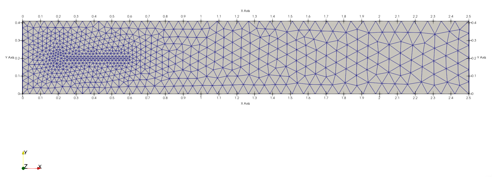
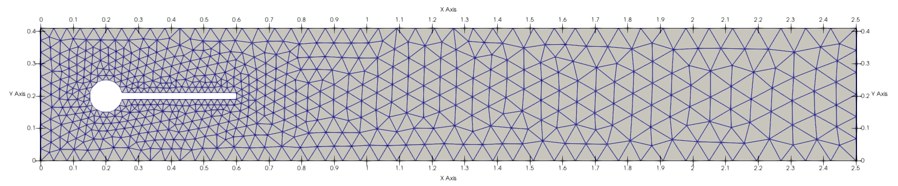
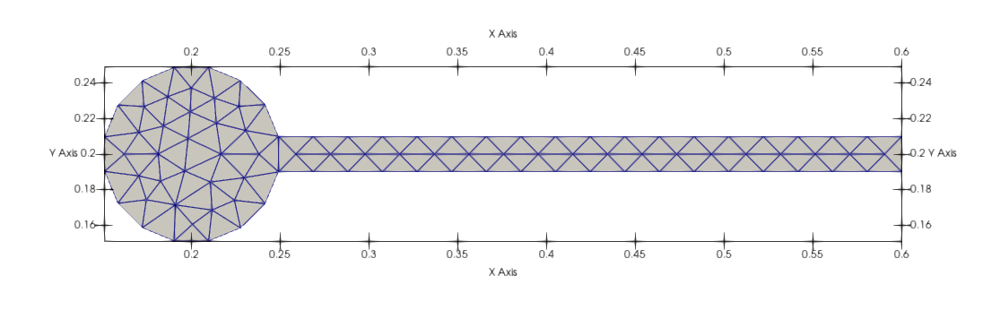

Flag 2D
===========

In this example, we will solve a 2D flag simulation known as 
DESCRIBE THE EXAMPLE IN A THEORY KIND OF WAY.

The input file used for this example is the following::

  general:
    geometry_module: flag2d
    output_dir: output/flag2d
    mesh_only: False
    structural_analysis: true
    fluid_analysis: true
  domain:
    x_min: 0.0
    x_max: 2.5
    y_min: 0.0
    y_max: 0.41
    l_char: .002
  pv_array:
    panel_chord: 0.35 # Sets the length of the flag (starts outside circle radius)
    # panel_chord: 0.0 # Sets the length of the flag (starts outside circle radius)
    panel_span: 0.05 # Sets the radius of the flag pole
    panel_thickness: 0.01 # Sets the thickness of the flag
    span_rows: 1
    stream_rows: 1
  solver:
    dt: 0.005
    t_final: 10.0
    solver1_ksp: gmres
    solver2_ksp: gmres
    solver3_ksp: gmres
    solver4_ksp: gmres
    solver1_pc: hypre
    solver2_pc: hypre
    solver3_pc: hypre
    solver4_pc: hypre
    save_text_interval: 0.005
    save_xdmf_interval: 0.005
  fluid:
    u_ref: 1.0 # 0.2 1.0 2.0
    rho: 1000.0 # 0.2 1.0 2.0
    nu: 0.001 # Establish re = 20 with diam = 0.1 and u = u_ref
    dpdx: 0.0
    turbulence_model: null
    periodic: false
    bc_y_max: noslip # slip noslip free
    bc_y_min: noslip # slip noslip free
    # warm_up_time: 0.25 # slip noslip free
  structure:
    dt : 0.005
    rho : 10000.0
    poissons_ratio: 0.4
    elasticity_modulus: 1.4e+06
    body_force_x: 0
    body_force_y: 0
    body_force_z: 0 #100
    bc_list: ["left"]
    motor_connection: False
    tube_connection: False

This example is executed using::

  python --input $PVade/input/flag2d.yaml

PVade start by generating the mesh for the computational domain. 
In this case we are generating 2 meshes, 1 for the fluid and 1 for the structure, which match at the boundary. 

The full computational Domain

The CFD domain

The structural domain

