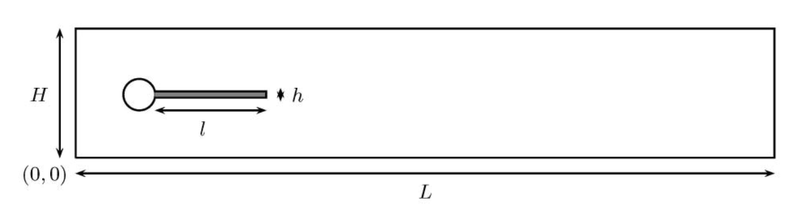
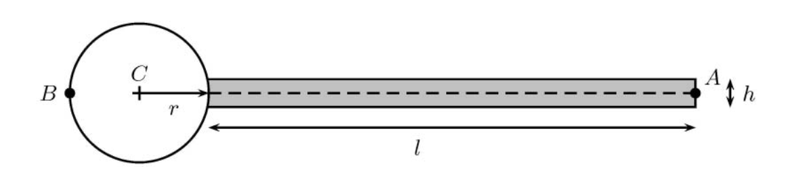
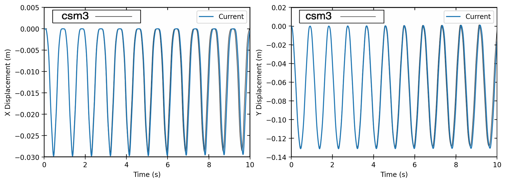

Flag 2D
===========
The Flag 2D example is used to benchmark PVade. 

Geometry Definition
-------------------

[E.Y] brief description of the problem 

The geometry of the problem is described in the Fig. 

where: 

L is the length of the domain 
H is the height of the domain 
l is the lentgh of the flag 
h is the thickness of the flag 

C is the center of the circle 
r is the radius of the circle
A is the measurment point for benchmarking  

For the upcoming benchmarks the following values are used:

.. container::
   :name: tab:geometry

   .. table:: Parameter settings for the CSM tests

      ==================================== =====
      par. dim.                            Value
      ==================================== =====
      :math:`H [m]`                        0.41
      :math:`L [m]`                        2.5
      :math:`h [m]`                        0.02
      :math:`l [m]`                        0.35
      :math:`C`                            (0.2,0.2)
      :math:`A`                            (0.6,0.2)
      :math:`r [m]`                        0.05
      ==================================== =====

Structural Benchmarking
-----------------------

The Benchmarking of the
Structural analysis is conducted against CSM3 analysis in the paper by

In CSM3, the structural tests are computed only for the elastic beam
(without the surrounding fluid) adding the gravitational force only on
the structural part, g = (0, g) [ m ]. The CSM3 test is computed as a
time dependent case starting from the undeformed configuration

The Parameters used for the benchmarking are defined below

.. container::
   :name: tab:properties

   .. table:: Parameter settings for the CSM tests

      ==================================== =====
      par. dim.                            Value
      ==================================== =====
      :math:`\rho_0 [10^3 \frac{kg}{m^3}]` 1
      :math:`\nu`                          0.4
      :math:`\mu [10^6 \frac{kg}{ms^3}]`   0.5
      ==================================== =====

[E.Y] add data and context for table below 

.. container::
   :name: tab:results

   .. table:: Results for CSM3 with timesteps :math:`\Delta T = 0.005`

      ===== ===== ======================== ========================
      \     ndof  ux of A [×10−3]          uy of A [×10−3]
      ===== ===== ======================== ========================
      CSM3  6468  −14.279 ± 14.280[1.0995] −63.541 ± 65.094[1.0995]
      PVADE 14118                             
      ===== ===== ======================== ========================

When we plot the "x" and "y" displacement of the point A versus time we obtain the following 

.. CFD Benchmarking 
.. ----------------
.. 
.. 
.. In order to benchmark the CFD part of PVade we are conductind CFD3 simulation in [include citation here], and comparing the list and drag values.  
.. Problem parameters table 
.. 
.. .. container::
..    :name: tab:my_label
.. 
..    .. table:: Parameter settings for the CSM tests
.. 
..       ==================================== =====
..       par. dim.                            Value
..       ==================================== =====
..       :math:`\rho^f [10^3 \frac{kg}{m^3}]` 1
..       :math:`\mu^f [10^-3 \frac{m^2}{s}]`  1
..       :math:`\bar{U} [\frac{m}{s}]         2
..       ==================================== =====
.. definition of bcs 
.. 
.. expression for inflow wind 

FSI Benchmarking 
----------------

In this example, we will solve a 2D flag simulation known as 
DESCRIBE THE EXAMPLE IN A THEORY KIND OF WAY.

The input file used for this example is the following::

  general:
    geometry_module: flag2d
    output_dir: output/flag2d
    mesh_only: False
    structural_analysis: true
    fluid_analysis: true
  domain:
    x_min: 0.0
    x_max: 2.5
    y_min: 0.0
    y_max: 0.41
    l_char: .002
  pv_array:
    panel_chord: 0.35 # Sets the length of the flag (starts outside circle radius)
    # panel_chord: 0.0 # Sets the length of the flag (starts outside circle radius)
    panel_span: 0.05 # Sets the radius of the flag pole
    panel_thickness: 0.01 # Sets the thickness of the flag
    span_rows: 1
    stream_rows: 1
  solver:
    dt: 0.005
    t_final: 10.0
    solver1_ksp: gmres
    solver2_ksp: gmres
    solver3_ksp: gmres
    solver4_ksp: gmres
    solver1_pc: hypre
    solver2_pc: hypre
    solver3_pc: hypre
    solver4_pc: hypre
    save_text_interval: 0.005
    save_xdmf_interval: 0.005
  fluid:
    u_ref: 1.0 # 0.2 1.0 2.0
    rho: 1000.0 # 0.2 1.0 2.0
    nu: 0.001 # Establish re = 20 with diam = 0.1 and u = u_ref
    dpdx: 0.0
    turbulence_model: null
    periodic: false
    bc_y_max: noslip # slip noslip free
    bc_y_min: noslip # slip noslip free
    # warm_up_time: 0.25 # slip noslip free
  structure:
    dt : 0.005
    rho : 10000.0
    poissons_ratio: 0.4
    elasticity_modulus: 1.4e+06
    body_force_x: 0
    body_force_y: 0
    body_force_z: 0 #100
    bc_list: ["left"]
    motor_connection: False
    tube_connection: False

This example is executed using::

  python --input $PVade/input/flag2d.yaml

PVade start by generating the mesh for the computational domain. 
In this case we are generating 2 meshes, 1 for the fluid and 1 for the structure, which match at the boundary. 

The full computational Domain

.. image:: pictures/2dflag/fulldomain.png
  :alt: Alternative text

The CFD domain

.. image:: pictures/2dflag/CFD_domain.png
  :alt: Alternative text

The structural domain

.. image:: pictures/2dflag/CSD_domain.png
  :alt: Alternative text

