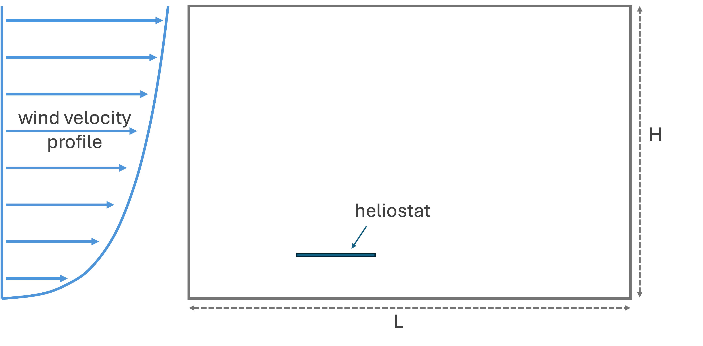
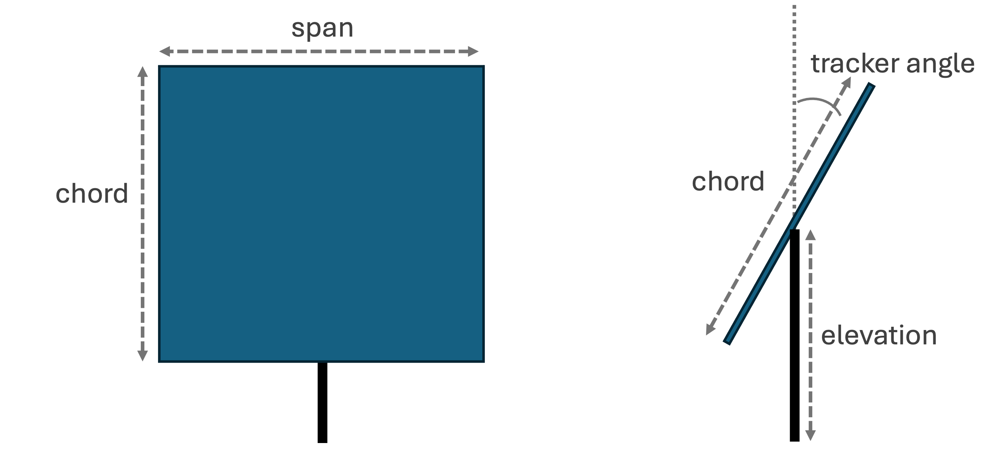
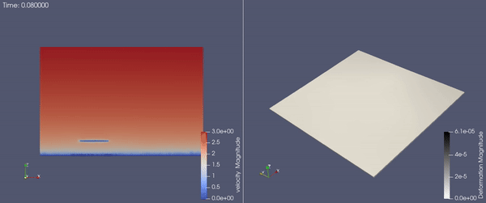

Heliostat 3D
===========
The Heliostat 3D example demonstrates the application of PVade to another solar energy technology, concentrated solar power (CSP). 

Geometry Definition
-------------------

The Heliostat 3D example consists of an atmospheric flow in which the fluid interacts with a heliostat, represented by a flat plate structure. High-frequency displacement of the heliostat emerges over time due to the fluid-structure interaction. The domain setup and geometry are described in the figure below.

where: 

L is the length of the domain 
H is the height of the domain 

chord is the length of the heliostat
span is the width of the heliostat
elevation is the height of the mounting point
tracker angle is the tilt angle of the heliostat

For this example, the following values are used, as shown in the input file (`input/single_heliostat.yaml`):

.. container::
   :name: tab:geometry

   .. table:: Parameter settings

      ==================================== =====
      parameter [units]                    Value
      ==================================== =====
      L [m]                                60
      H [m]                                40
      chord [m]                            10.0
      span [m]                             11.0
      elevation [m]                        5.5
      tracker angle [degrees]              0
      ==================================== =====

This example is executed in parallel using::

  mpirun -n 8 python ns_main.py --input_file input/single_heliostat.yaml

However, this example is best run on a supercomputer using the included batch script (`PVade/docs/how_to_guides/examples/runscripts/run.sh`)::

    sbatch run.sh

This example yields the following result:

