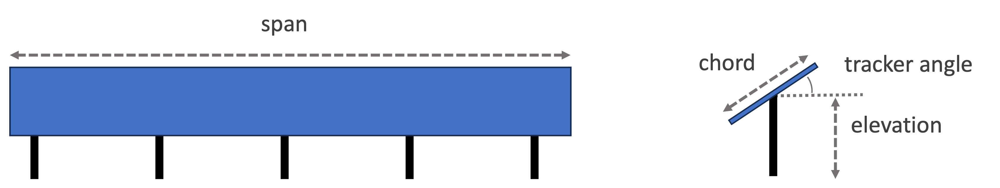
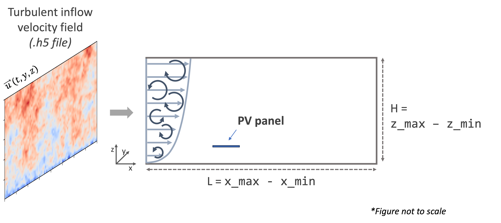
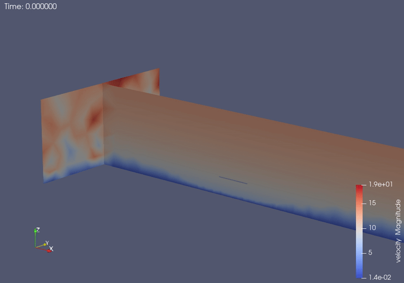

PV Panels 3D with Turbulent Inflow
===========
This example demonstrates the use of PVade to simulate dynamic PV loading amidst a turbulent inflow velocity field. 

Currently, this feature only works in 3D simulations.

Geometry Definition
-------------------

This example consists of a turbulent atmospheric flow in which the fluid interacts with a single row of PV panels. The domain setup and geometry are described in the figure below.

where: 

chord is the length of the solar panel, 
span is the width of the solar panel, 
elevation is the height of the mounting point, and
tracker angle is the tilt angle of the solar panel.

L is the length of the domain and
H is the height of the domain.

For this example, the following values are used, as shown in the input file (``input/turbinflow_duramat_case_study.yaml``):

.. container::
   :name: tab:geometry

   .. table:: Parameter settings

      ==================================== =====
      parameter [units]                    Value
      ==================================== =====
      L [m]                                80
      H [m]                                20
      chord [m]                            4.1
      span [m]                             10.0
      elevation [m]                        2.1
      tracker angle [degrees]              0
      ==================================== =====

Synthetic Turbulence Generation
-------------------------------

The turbulent inflow velocity field is generated externally using `pyconturb` [1]_. This example uses unconstrained turbulence generated using the notebook here: ``examples/synthetic_turbulent_inflow/generate_turbulent_inflow_h5_file.ipynb``.

The generated turbulent velocity field is written to an .h5 file (e.g. ``input/pct_turb_ny80_nz80_unconstrained_1.0s_dt0.01_uref20.h5``) so that it can be read in by `pvade`. This file contains velocity data of shape (nt, ny, nz) where nt = number of timesteps, ny = number of gridpoints in the spanwise direction, and nz = number of gridpoints in the vertical direction. At each timestep, `pvade` selects the y-z slice of turbulent inflow for that timestep and applies it as the boundary condition at the inlet.

Currently, this functionality only works for 3D simulations.

Running this example locally
----------------------------

This example is executed in parallel using::

  mpirun -n 8 python pvade_main.py --input_file input/turbinflow_duramat_case_study.yaml

For testing purposes, this example can be run for less time using::

  mpirun -n 8 python pvade_main.py --input_file input/turbinflow_duramat_case_study.yaml --domain.l_char 2.5 --solver.t_final 0.2

Running this example on HPC
---------------------------

This example is best run on a supercomputer using the included batch script as an example(``PVade/docs/how_to_guides/examples/runscripts/run.sh``). You will need to change the environment path and the paths to the files to your own.

First, create a symbolic link to the ``input`` folder from where you are launching the simulation::

    ln -s <path_to_PVade>/input input

Then, edit and run the following script to launch the simulation::

    sbatch run.sh

For more details on running on HPC, please refer to :ref:`Running on HPC`.

This example yields the following result:

References
----------
.. [1] J. M. Rinker, “PyConTurb: Constrained Stochastic Turbulence for Wind Energy Applications,” 2017, https://gitlab.windenergy.dtu.dk/pyconturb/pyconturb
