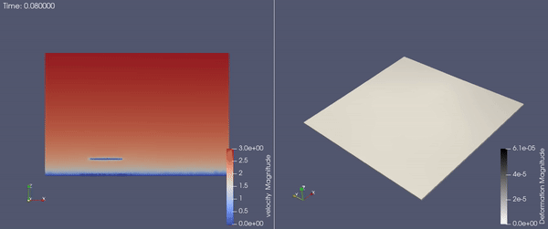

PV Panels 3D with Turbulent Inflow
===========
This example demonstrates the use of PVade to simulate dynamic PV loading amidst a turbulent inflow velocity field. 

Geometry Definition
-------------------

This example consists of a turbulent atmospheric flow in which the fluid interacts with a single row of PV panels. High-frequency displacement of the PV panel emerges over time due to the fluid-structure interaction. The domain setup and geometry are described in the figure below.

.. image:: pictures/duramat_dimensions.png
  :alt: Alternative text

where: 

L is the length of the domain 
H is the height of the domain 

chord is the length of the solar panel
span is the width of the solar panel
elevation is the height of the mounting point
tracker angle is the tilt angle of the solar panel

For this example, the following values are used, as shown in the input file (`input/turbinflow_duramat_case_study.yaml`):

.. container::
   :name: tab:geometry

   .. table:: Parameter settings

      ==================================== =====
      parameter [units]                    Value
      ==================================== =====
      L [m]                                80
      H [m]                                10
      chord [m]                            4.1
      span [m]                             10.0
      elevation [m]                        2.1
      tracker angle [degrees]              0
      ==================================== =====

This example is executed in parallel using::

  mpirun -n 8 python pvade_main.py --input_file input/turbinflow_duramat_case_study.yaml

You can run it for less time for testing purposes using::

  mpirun -n 8 python pvade_main.py --input_file input/turbinflow_duramat_case_study.yaml --domain.l_char 2.5 --solver.t_final 0.2

However, this example is best run on a supercomputer using the included batch script (`PVade/docs/how_to_guides/examples/runscripts/run.sh`)::

    sbatch run.sh

This example yields the following result:

