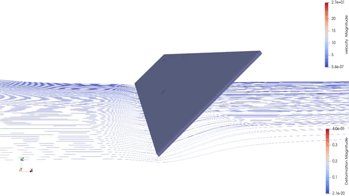

.. PVade documentation master file, created by
   sphinx-quickstart on Fri Mar 10 11:27:06 2023.
   You can adapt this file completely to your liking, but it should at least
   contain the root `toctree` directive.

Welcome to PVade's documentation!
=================================

PVade is an open source fluid-structure interaction model which can be used to study wind loading and stability on solar-tracking PV arrays. PVade can be used as part of a larger modeling chain to provide stressor inputs to mechanical module models to study the physics of failure for degradation mechanisms such as cell cracking, weathering of cracked cells, and glass breakage.

.. note::
   This is an active research project and there may be areas where the documentation needs additional work to keep up with our latest developments. While we work to close this gap, feel free to raise issues or ask questions on GitHub_.

.. _GitHub: https://github.com/NatLabRockies/PVade

Organization
------------

Documentation is organized into four main sections:

`User Guide `: User-facing guides covering basic topics and use cases for the PVade software
`Theory `: The governing equations and modeling background used by PVade
`Implementation `: Programming details, API reference material, and supporting background
`Testing `: Notes on the automated test suite and how to run it

New users may find it helpful to review the User Guide materials first.

Contents
--------

.. toctree::
   :maxdepth: 2

   doxygen/index
   background

.. toctree::
   :maxdepth: 1
   :caption: USER GUIDE

   installing_pvade
   running_pvade
   hpc_jobs
   benchmark
   how_to_cite_pvade
   examples/index

.. toctree::
   :maxdepth: 2
   :caption: THEORY

   governing_equations
   mesh_generation
   CFD
   CSD
   mesh_movement

.. toctree::
   :maxdepth: 2
   :caption: IMPLEMENTATION

   
   api_reference
   .. background/index

.. toctree::
   :maxdepth: 2
   :caption: TESTING

   testing
   
